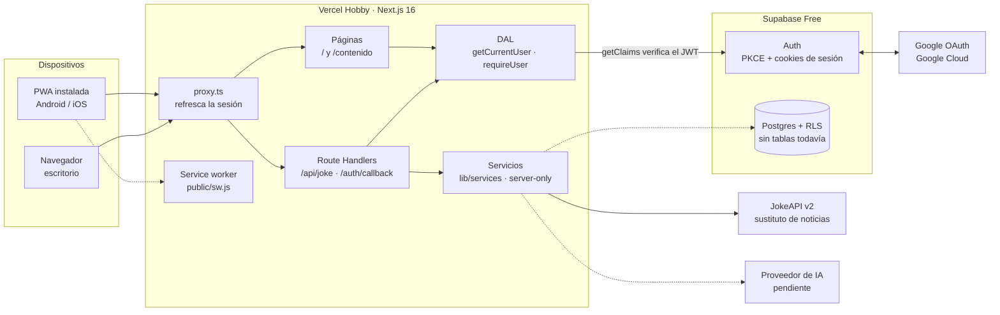
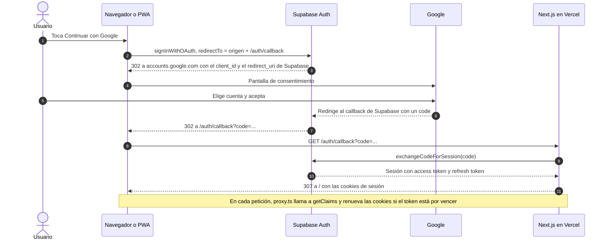
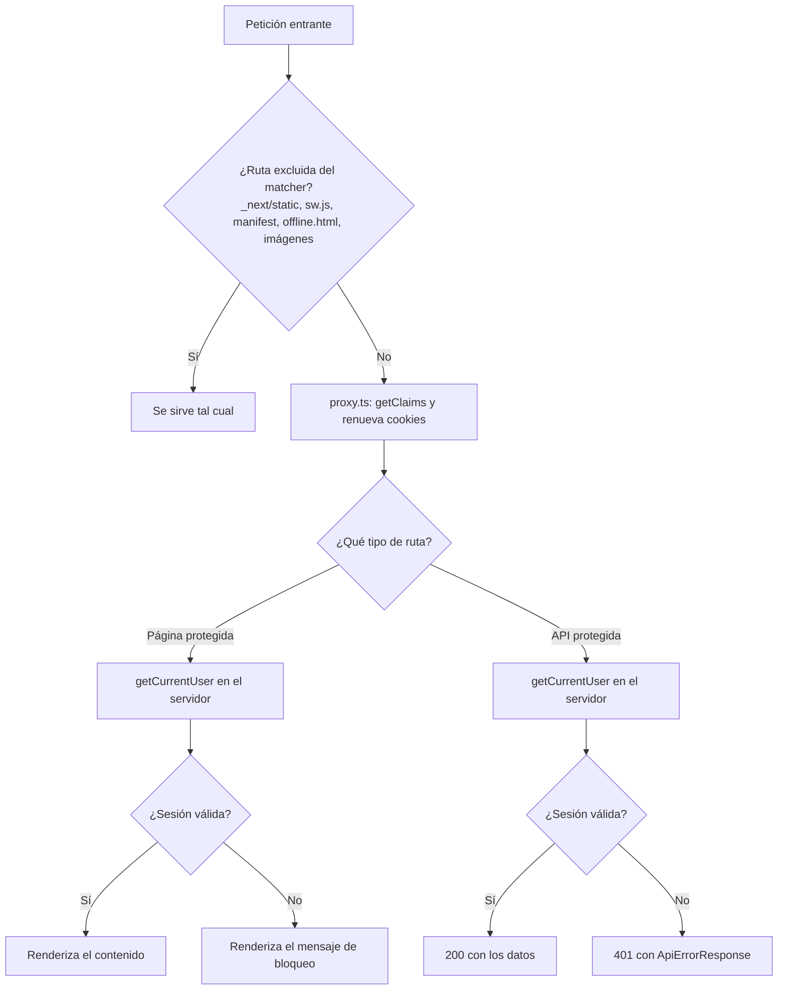
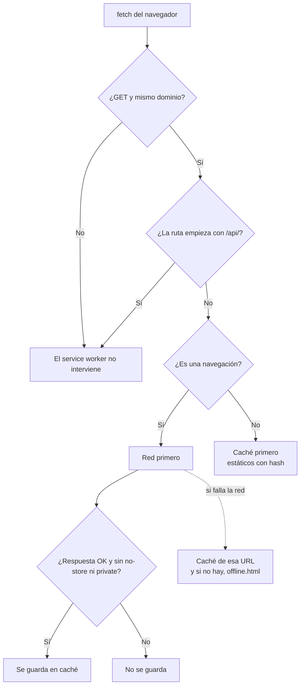

# Infra handoff · RESPIA News

> Estado a **4 de octubre de 2026**. Este documento es autocontenido: todo lo que
> menciona vive dentro de este repositorio. El enunciado del proyecto está en
> [`Proyecto 2 AI Assisted News App.pdf`](Proyecto%202%20AI%20Assisted%20News%20App.pdf).
>
> Cómo se elaboró: redactado con asistencia de IA a partir de la lectura del
> código fuente y de verificaciones ejecutadas el 4 de octubre de 2026 contra
> producción y contra el repo (sección 11).

## Contenido

1. [Resumen](#1-resumen)
2. [Qué pide el proyecto y cómo lo cubre la infraestructura](#2-qué-pide-el-proyecto-y-cómo-lo-cubre-la-infraestructura)
3. [Por qué Supabase Auth y no Firebase](#3-por-qué-supabase-auth-y-no-firebase)
4. [Arquitectura](#4-arquitectura)
5. [Stack y versiones](#5-stack-y-versiones)
6. [Servicios externos y su configuración](#6-servicios-externos-y-su-configuración)
7. [Variables de entorno](#7-variables-de-entorno)
8. [Mapa del código](#8-mapa-del-código)
9. [Decisiones de diseño](#9-decisiones-de-diseño)
10. [Modelo de seguridad y recetas](#10-modelo-de-seguridad-y-recetas)
11. [Qué se probó y cómo](#11-qué-se-probó-y-cómo)
12. [Ciclos de ingeniería: dónde la evidencia cambió una decisión](#12-ciclos-de-ingeniería-dónde-la-evidencia-cambió-una-decisión)
13. [Base de datos: estado y reglas](#13-base-de-datos-estado-y-reglas)
14. [Operación diaria](#14-operación-diaria)
15. [Límites, riesgos y deuda técnica](#15-límites-riesgos-y-deuda-técnica)

---

## 1. Resumen

**Producción:** <https://respia-news.vercel.app>

**Qué hay hoy:** una PWA (Next.js 16) instalable en Android e iOS, con login con
Google a través de Supabase Auth, una pantalla pública, una pantalla protegida y
una API protegida. Esas dos últimas usan un backend de mentira (JokeAPI) como
sustituto de las noticias, para demostrar la cadena completa
navegador → backend → proveedor externo con control de acceso real.

**Qué NO hay todavía:** tablas en la base de datos, noticias, IA, portal
administrativo, feed, chat, ubicación simulada. Eso son las features del equipo;
la infraestructura está hecha para que se construyan encima.

**Costo actual: USD 0.** Vercel Hobby + Supabase Free + Google OAuth. Los USD 20
del presupuesto quedan íntegros para créditos de API de IA, que es para lo que el
enunciado los reserva.

| Capacidad | Estado | Cómo se verificó |
|---|---|---|
| Despliegue automático en Vercel | ✅ | Build de producción exitoso, sitio responde |
| PWA instalable en Android | ✅ | Instalada y usada en dispositivo real |
| PWA instalable en iOS | ✅ | Instalada desde Safari y usada en dispositivo real |
| Login con Google en Android | ✅ | Probado en dispositivo real |
| Login con Google en iOS con la PWA instalada (modo standalone) | ✅ | Probado en dispositivo real. Era el mayor riesgo técnico |
| Bloqueo en servidor (401 / pantalla bloqueada sin sesión) | ✅ | `curl` contra producción, sección 11 |
| Refresco automático de sesión | ✅ | Implementado en `src/proxy.ts` (sección 4.3) |
| Base de datos con tablas de noticias y RLS | ⏳ | Aún no existen tablas de noticias (las define Backend). Los scripts base están en `docs/sql/` (sección 13) |
| Pantalla de consentimiento de Google publicada | ⏳ | Sigue en modo *Testing*, sección 6 |

---

## 2. Qué pide el proyecto y cómo lo cubre la infraestructura

Citas textuales del enunciado que condicionan la arquitectura:

| El enunciado dice | Cómo lo cubre la infra | Estado |
|---|---|---|
| "una aplicación móvil funcional y visualmente cuidada en iPhone y Android" | PWA mobile-first, un solo código para ambos sistemas | ✅ base |
| "una forma práctica de compartir y probar la aplicación durante la clase, **sin publicarla en tiendas**" | Se comparte una URL; se instala desde el navegador. Publicar en tiendas costaría más que todo el presupuesto (Google Play 25 USD, Apple 99 USD/año) | ✅ |
| "El usuario iniciará sesión en la aplicación móvil con Google" | Supabase Auth + proveedor Google | ✅ |
| "un portal web administrativo con autenticación" | Misma autenticación. Falta distinguir quién es administrador | ⏳ backend |
| "El límite total es **USD 20 por equipo** en créditos de API de IA" y "la infraestructura adicional debería usar niveles gratuitos" | Todo en planes gratuitos | ✅ |
| "Cada usuario podrá seleccionar una **ubicación simulada**" | Es de producto, no de infra. Requiere guardar la preferencia | ⏳ backend |

**Importante, nombre del proveedor de autenticación:** el enunciado dice dos veces
"Firebase Authentication". El equipo usa **Supabase Auth**, con aprobación del
catedrático (22 de septiembre de 2026), que pidió que la decisión estuviera bien
investigada. La sustentación está en la sección siguiente; hay que poder
defenderla en la presentación final.

---

## 3. Por qué Supabase Auth y no Firebase

### Argumentos que se sostienen con evidencia

1. **Los datos del proyecto son relacionales.** El feed con ranking, el portal
   administrativo y la demo de comparar resultados entre ubicaciones simuladas son
   consultas con filtros y ordenamiento. Postgres encaja directo; Firestore obliga
   a desnormalizar y resolver ordenamientos en código.
2. **Segunda capa de control de acceso, demostrable en vivo.** Con Row Level
   Security (RLS), una llamada directa a la API de datos con la llave pública y sin
   sesión no obtiene el cuerpo de un artículo aunque se salte la aplicación. El
   enunciado pide mostrar con evidencia cómo el sistema maneja sus
   responsabilidades; esto es evidencia concreta de defensa en profundidad.
3. **Sesión en servidor con Next.js App Router.** `@supabase/ssr` es la librería
   de primera parte para esto. Con Firebase, la capa de sesión (cookies de sesión
   con `firebase-admin`) la construye y mantiene el equipo, y sus dos patrones
   oficiales tienen una incompatibilidad documentada: una cookie creada con
   `createSessionCookie` no sirve como `authIdToken` de `initializeServerApp`.
4. **Firebase Auth sobre Vercel tiene fricción con Safari.** `signInWithRedirect`
   usa un iframe cross-origin que falla en navegadores que bloquean almacenamiento
   de terceros (Safari 16.1+, Chrome M115+), y la lista de dominios autorizados de
   Firebase no admite comodines, así que las previews de Vercel romperían el login.
   Supabase sí admite comodines en su lista de redirects.

### Lo que juega a favor de Firebase (para no esconderlo)

- Lo nombra el enunciado.
- No pausa el proyecto por inactividad (Supabase Free sí, sección 15).
- Crea el cliente OAuth de Google automáticamente al activar el proveedor.

### Argumentos que NO se deben usar (se cayeron al revisarlos)

| Argumento | Por qué no |
|---|---|
| "Supabase da pgvector para el RAG del chat" | El enunciado no pide RAG ni búsqueda vectorial; fue una suposición |
| "Firebase no funciona en el middleware de Next.js" | Obsoleto: en Next.js 16 el `proxy.ts` corre en Node.js, donde `firebase-admin` funciona |
| "Con Firebase habría que registrar los correos a mano por el tope de 100 usuarios" | Ese tope es de la pantalla de consentimiento de Google y aplica **igual** a Supabase y a Firebase |
| "Supabase es claramente mejor para OAuth" | Están casi empatados: Firebase gana la configuración inicial, Supabase gana la sesión en servidor |

---

## 4. Arquitectura

### 4.1 Vista general



Las líneas punteadas son conexiones **previstas** que aún no existen en el código.

### 4.2 Flujo de login



Puntos que conviene entender:

- La app **nunca habla directo con Google**: Supabase es el intermediario. Por eso
  la URI de redirección registrada en Google es la de Supabase, no la de la app.
- `redirectTo` se arma con el origen actual del navegador, así que el mismo código
  funciona en `localhost`, en las previews y en producción. Cada origen debe estar
  en la lista de Redirect URLs de Supabase (sección 6).
- Si algo falla, el callback vuelve a `/` con `?auth_error=<motivo>` y la portada
  lo muestra en pantalla.

### 4.3 Qué pasa en cada petición



**El proxy NO autoriza.** Solo refresca la sesión. La decisión de dar o negar
acceso la toma cada página y cada API, con el DAL. Si el bloqueo viviera solo en el
proxy, bastaría con que una ruta se escapara del matcher para dejar los datos al
aire.

### 4.4 Qué hace el service worker



Consecuencia práctica: como `/` y `/contenido` leen la sesión, Next.js las marca
`private, no-store` y **el service worker no las guarda**. Sin conexión, la app
muestra la pantalla "Sin conexión" (`public/offline.html`); todavía **no hay
contenido disponible offline**. Eso es trabajo futuro del feed y de las noticias
(solo se podrá cachear lo que sea público).

---

## 5. Stack y versiones

Fuente: `package.json`.

| Pieza | Versión | Nota |
|---|---|---|
| Next.js | 16.3.4 | App Router, Turbopack. El archivo del proxy es `src/proxy.ts` y exporta `proxy` (antes se llamaba `middleware`) |
| React | 19.3.0 | |
| TypeScript | ^5.9.3 | Modo estricto + `noUncheckedIndexedAccess`. No usar la 7.x: demasiado nueva para Next 16 |
| `@supabase/ssr` | ^0.12.7 | Cookies de sesión para Next. **No** usar `@supabase/auth-helpers-nextjs` (deprecado; muchos tutoriales aún lo usan) |
| `@supabase/supabase-js` | ^2.117.1 | |
| `server-only` | ^0.0.1 | Hace fallar el build si un módulo de servidor se importa desde el cliente |
| ESLint | ^9.39.5 | **Fijado en 9.x a propósito**: la 10 rompe con el `eslint-plugin-react` de `eslint-config-next` 16. No subir hasta que Next lo actualice |
| Node | `>=20.9.0` (campo `engines`) | Vercel muestra un aviso en el build porque el rango es abierto: es solo informativo |
| Tipografías | Bricolage Grotesque, Inter, JetBrains Mono | Vía `next/font`: se descargan en el build y se sirven desde el propio dominio |

**Decisión del equipo: no se usan pruebas automatizadas.** La verificación es
manual y con scripts (sección 11).

---

## 6. Servicios externos y su configuración

Tres cuentas intervienen. El responsable de infra es dueño de las tres; el equipo
accede como se indica en cada una.

### 6.1 Vercel

| Aspecto | Valor |
|---|---|
| Proyecto | `respia-news` → <https://respia-news.vercel.app> |
| Plan | Hobby: gratis, **uso no comercial**, un solo desarrollador, límites con tope duro (no cobra excedentes) |
| Origen | GitHub `chuy-zip/RESPIA_NEWS` (repositorio **público**), rama `main` |
| Build | `npm run build` (Next.js 16.3.4 con Turbopack), Washington D.C. (`iad1`), 2 núcleos y 8 GB. ~20 s en el primer despliegue |
| Despliegue | **Automático.** Cada cambio que llega a `main` publica a producción (integración Git de Vercel); nadie despliega a mano |
| Variables de entorno | Cargadas en Production, Preview y Development (sección 7) |
| Funciones | Región por defecto `iad1`. **Duración máxima: 300 s** en Hobby (con Fluid compute, el valor por defecto en proyectos nuevos). Memoria 2 GB. Cuerpo de petición y respuesta: máx. 4.5 MB |
| Cabeceras propias | Solo `/sw.js` (`next.config.ts`) |

**Los despliegues son automáticos: nadie despliega a mano.** El proyecto de Vercel
está conectado al repositorio de GitHub. Cuando un cambio llega a `main` (push o
merge de una Pull Request), Vercel construye y publica a producción por su cuenta,
en unos 20 segundos. Por eso:

- **Ningún compañero necesita acceso a Vercel** ni ejecutar comandos de despliegue.
  Su trabajo termina en GitHub.
- No se usa la CLI de Vercel (`vercel`, `vercel --prod`) en este proyecto.
- Para ver el resultado basta con abrir <https://respia-news.vercel.app> o seguir
  el estado del despliegue en la pestaña de checks de la Pull Request.

**Limitación del plan Hobby.** Hobby no admite colaboración: según la guía de
Vercel, solo el dueño de la cuenta puede disparar despliegues, y los commits de
otros autores pueden quedar bloqueados ("deployment blocked"). El repositorio es
público, pero esa guía no hace excepción por eso. Si pasa, las alternativas son, de
menos a más costosa: (1) que el dueño de la cuenta integre las Pull Requests a `main`; (2)
probar en local con `npm run dev` y el `.env.local` compartido; (3) Vercel Pro
(20 USD/mes por asiento), descartado porque rompe la regla de usar solo niveles
gratuitos.

### 6.2 Supabase

| Aspecto | Valor |
|---|---|
| Proyecto | `RESP-IA-NEWS-Project` (organización `chuy2_org`), plan Free |
| Data API | Activada |
| *Automatically expose new tables* | **Desactivado.** Una tabla nueva no es accesible por la API hasta que se le dan `GRANT` explícitos (sección 13) |
| *Enable automatic RLS* | **Activado.** Toda tabla nueva en `public` nace con RLS |
| Proveedor Google | Activo. *Skip nonce checks*: apagado. *Allow users without an email*: apagado (dejar así: son escapes para casos raros) |
| Proveedores de login | Debe estar activo **solo Google**. Verificado el 4 de octubre de 2026 con el endpoint público `/auth/v1/settings`: Google activo; anónimo y teléfono apagados; **Email todavía activo**, y conviene desactivarlo (Authentication → Sign In / Providers → Email) porque deja crear cuentas con correo y contraseña por la API. **No** desactivar *Allow new users to sign up*: bloquearía también a los usuarios nuevos de Google |
| Llaves JWT | ECC (P-256) como vigente + HS256 *legacy* como anterior. **No revocar la legacy**: las llaves antiguas `anon` y `service_role` están firmadas con ella. Dejarla es inofensivo |
| Llaves de API | Se usa solo la **publishable** (`sb_publishable_…`). La **secret** (`sb_secret_…`) no se usa en ninguna parte. No usar las `anon`/`service_role` legacy: se retiran a fines de 2026 |
| Site URL | La URL de producción. **No** dejar `localhost`: es el error clásico que expulsa al usuario a una dirección que no existe |
| Redirect URLs | `http://localhost:3000/**`, `https://respia-news.vercel.app/**` y un comodín para las previews de Vercel (`https://respia-news-*.vercel.app/**`). Se administran en Authentication → URL Configuration |
| Límites del plan Free | 500 MB de base de datos, 5 GB de egress sin caché más 5 GB con caché, 1 GB de storage, 50.000 usuarios activos al mes, 2 proyectos activos. **Se pausa tras 7 días sin actividad de base de datos** (sección 13). Sin copias de seguridad descargables (valores de la documentación pública de planes; confirmar en el dashboard) |

**Acceso del equipo al dashboard.** Se invita por correo desde la configuración de
equipo de la organización con rol **Developer**. La invitación vence a las 24 h; el
acceso, una vez aceptada, no vence. Developer da acceso al contenido del proyecto
(SQL Editor, Table Editor) y no permite cambiar la configuración del proyecto. No dar Owner ni Administrator: cuentan contra la cuota de proyectos
gratis del invitado. El rol *Read-only* no existe en el plan Free.

**No crear usuarios de Postgres por persona.** Un rol de base de datos creado a
mano queda sujeto a RLS y no coincide con las políticas (que apuntan a `anon` y
`authenticated`), así que vería las tablas **vacías** en lugar de un error, una
fuente de confusión. Para inspeccionar datos, usar el dashboard.

### 6.3 Google Cloud (OAuth)

| Aspecto | Valor |
|---|---|
| Proyecto | `RESP-AI` |
| Google Auth Platform → Audience | **External**, estado **Testing** |
| Cliente OAuth | Tipo *Web application* |
| URI de redirección autorizada | `https://<project-ref>.supabase.co/auth/v1/callback`: la de **Supabase**, no la de la app |
| Orígenes JavaScript autorizados | `https://respia-news.vercel.app` y `http://localhost:3000`. Solo dominios, sin ruta |
| Scopes | `openid`, `userinfo.email`, `userinfo.profile`. Son no sensibles. **No agregar otros**: cualquier scope sensible dispara una verificación de Google que tarda días |
| Branding | Sin logo, a propósito: subirlo dispara la verificación de marca |
| Costo | Gratis. Crear la pantalla de consentimiento y el cliente no pide cuenta de facturación |

Comportamientos conocidos que no son errores:

- **La pantalla de Google muestra `<project-ref>.supabase.co`** en lugar de
  "RESPIA News". Google solo muestra el nombre de la app cuando la marca está
  verificada; sin eso, muestra el dominio, que aquí es el de Supabase. Se arregla
  con verificación de marca o con un dominio propio para Auth (función de pago).
  Es cosmético.
- **En modo Testing** solo pueden entrar los usuarios agregados como "Test users"
  (tope de 100) y las autorizaciones caducan a los 7 días.
- **Publicar la app exige una URL de inicio y una URL de política de privacidad.**
  Google bloqueó el botón de publicar por eso. Falta crear la página `/privacidad`
  (sección 15).

**Anomalía sin explicar.** Un correo que no estaba en la lista de usuarios de
prueba pudo iniciar sesión estando la app en Testing. No se determinó la causa.
Hipótesis, de más a menos probable: (1) es el mismo buzón con otra forma de
escribirlo (Gmail ignora los puntos y los sufijos `+algo`); (2) la cuenta tiene un
rol en el proyecto de Google Cloud; (3) la app terminó publicada sin notarlo. Se
resuelve mirando el campo *Publishing status* en Audience.

**Consecuencia importante:** el modo Testing de Google **nunca fue nuestro control
de acceso**. Es un freno de Google sobre apps sin verificar, no una lista blanca
hermética, y desaparece al publicar. Hoy, **cualquier cuenta de Google obtiene
sesión** en la app. Es coherente con el enunciado (los compañeros deben poder
entrar a la demo), pero cualquier restricción real (por ejemplo, quién es
administrador) debe construirse **dentro de la aplicación y la base de datos**.

---

## 7. Variables de entorno

Fuente: `process.env` en el código y `.env.example`.

| Variable | ¿Obligatoria? | Dónde se lee | Para qué |
|---|---|---|---|
| `NEXT_PUBLIC_SUPABASE_URL` | Sí | `lib/supabase/client.ts`, `server.ts`, `proxy.ts` | URL del proyecto Supabase |
| `NEXT_PUBLIC_SUPABASE_PUBLISHABLE_KEY` | Sí | las mismas | Llave publicable de Supabase |
| `NEXT_PUBLIC_SITE_URL` | No | `lib/site.ts` | URL pública para metadatos. Solo hace falta con dominio propio |
| `JOKES_LANG` | No | `lib/services/jokes.ts` | Idioma del chiste de prueba. Sin definir, el proveedor responde en inglés (que tiene mucha más variedad). Desaparece con el servicio real |
| `VERCEL_PROJECT_PRODUCTION_URL` | Automática en Vercel | `lib/site.ts` | Alternativa para obtener la URL pública sin configurar nada |
| `NODE_ENV` | Automática | `ServiceWorkerRegistrar`, `auth/callback` | Distingue desarrollo de producción |

`.env.example` solo lista las dos obligatorias.

**Reglas:**

- `.env.local` **no se versiona** (lo ignora `.gitignore` con el patrón
  `.env*.local`). Solo `.env.example` está en git, sin valores.
- Todo lo que empieza con `NEXT_PUBLIC_` **viaja al navegador**. La llave
  publicable está pensada para eso: no es un secreto. Lo que protege los datos es
  la verificación en servidor y RLS, no esconder esa llave.
- **Nunca** poner una llave secreta con prefijo `NEXT_PUBLIC_`, ni en el repo.
- **El repositorio es público:** todo lo que se suba lo ve cualquiera, y Git
  conserva el historial. Un secreto subido por error hay que **revocarlo y
  cambiarlo**; borrarlo en un commit posterior no basta.
- `sb_secret_…` y `service_role` se saltan RLS. Hoy no se usan. Solo se introducirían
  para un trabajo del servidor que necesite escribir sin sesión de usuario, y
  entonces en una variable **sin** `NEXT_PUBLIC_`.

**Cómo agregar una variable nueva:**

1. Agregarla en `.env.local`.
2. Cargarla en Vercel → Settings → Environment Variables, marcando los entornos
   que correspondan. Las previews necesitan las variables igual que producción: si
   se omiten ahí, el login funciona en producción y falla en cada rama.
3. Documentarla en `.env.example` (sin valor) y en esta tabla.
4. Redesplegar: las variables nuevas no aplican a despliegues ya construidos.

**Cuando llegue la llave del proveedor de IA** será un secreto real: sin
`NEXT_PUBLIC_`, solo leída desde código de servidor (`import "server-only"`), y
compartida únicamente con quien la necesite. Si el proveedor permite varias llaves,
conviene una por persona con tope de gasto, dado que el presupuesto total es de
USD 20.

**Cómo compartir el `.env` con el equipo:** por un canal privado, nunca en el repo
ni en un chat público. Las dos variables actuales no son secretas, pero se tratan
como internas.

### ¿Por qué la app funciona con solo dos variables públicas?

Porque en este diseño **la llave no es lo que protege nada**. Hay tres ideas:

1. **La llave publicable identifica *qué* accede, no *quién*.** Dice "esta petición
   viene de la app de este proyecto" y la ubica en el rol `anon` de Postgres. Por sí
   sola da un acceso mínimo. La documentación de Supabase la declara segura de
   exponer (en páginas web, apps móviles o de escritorio y código fuente) y aclara
   que solo alcanza lo que Row Level Security permite.
2. **Lo que protege los datos es la identidad del usuario más RLS**, no esconder
   una llave. Cuando haya tablas, aunque alguien tome la llave del navegador y llame
   a la API de datos, Postgres solo le entrega lo que las políticas permitan para
   su rol. Por eso la configuración del proyecto nace en modo "negar todo".
3. **Nuestro servidor no necesita un secreto para validar la sesión.** El JWT del
   usuario va firmado con una llave **asimétrica** (ECC P-256): Supabase firma con
   la privada, que nunca sale de su plataforma, y `getClaims()` verifica con la
   **pública**, publicada por el propio proyecto. Es lo que hace el código de
   `@supabase/auth-js` instalado: con algoritmos asimétricos verifica la firma
   localmente con la llave pública; solo con los simétricos (`HS256`) tendría que
   consultar al servidor de Auth.

Entonces, **¿dónde están los secretos hoy?** Existen, pero ninguno vive en el
repo ni en Vercel:

| Secreto | Dónde vive | Quién lo ve |
|---|---|---|
| *Client Secret* de Google OAuth | Pegado en el dashboard de Supabase (Authentication → Providers → Google) | Solo quien administra Supabase |
| Llave privada con la que se firman los JWT | Dentro de Supabase | Nadie |
| Contraseña de la base de datos | La conoce el responsable de infra | Solo para clientes SQL externos (DBeaver, pgAdmin…), nunca desde la app |
| Llave `sb_secret_…` (se salta RLS) | **No se creó ni se usa** | — |

El flujo de login con **PKCE** tampoco necesita un secreto en la app: el canje del
`code` en `/auth/callback` se hace con un verificador de un solo uso que guarda el
propio navegador.

**¿Cuándo sí habrá un secreto en Vercel?**

- **La llave del proveedor de IA:** será el primero y el más importante.
  Sin `NEXT_PUBLIC_`, solo en código de servidor.
- **`sb_secret_…`**, solo si algún trabajo del servidor necesita escribir saltándose
  RLS (por ejemplo, una importación programada). Preferir no usarla.

**La consecuencia práctica:** la llave publicable no se cuida, pero **las políticas
de acceso sí**. Una tabla sin RLS o con una política demasiado abierta sí deja los
datos expuestos a cualquiera que tenga esa llave, que es pública. Por eso la regla
de la sección 13 ("RLS en toda tabla") no es opcional.

---

## 8. Mapa del código

```
prod/
├─ docs/                          Esta documentación y el enunciado en PDF
│  └─ sql/                        Scripts SQL numerados de Supabase (se ejecutan en el SQL Editor)
├─ public/
│  ├─ sw.js                       Service worker. Se sirve tal cual, sin build
│  ├─ offline.html                Pantalla sin conexión. HTML y CSS propios, sin React
│  └─ icons/                      Iconos de la PWA (generados con npm run icons)
├─ scripts/generate-icons.mjs     Genera los PNG sin dependencias externas
└─ src/
   ├─ proxy.ts                    Entrada del proxy de Next 16: refresca la sesión
   ├─ app/
   │  ├─ layout.tsx               Fuentes, metadatos (incl. iOS) y registro del service worker
   │  ├─ manifest.ts              Manifiesto de la PWA (/manifest.webmanifest)
   │  ├─ page.tsx                 Portada pública (dinámica: lee la sesión)
   │  ├─ contenido/page.tsx       Pantalla protegida
   │  ├─ auth/callback/route.ts   Canje del código OAuth por sesión
   │  ├─ actions/auth.ts          Server Action: cerrar sesión
   │  └─ api/joke/route.ts        API protegida de prueba
   ├─ components/                 UI agrupada por rol: auth/ layout/ pwa/ smoke-test/ ui/
   ├─ lib/
   │  ├─ supabase/                client.ts · server.ts · proxy.ts
   │  ├─ auth/dal.ts              Data Access Layer: identidad (getCurrentUser, requireUser) y rol (isAdmin, requireAdmin)
   │  ├─ services/jokes.ts        Servicio de prueba (server-only)
   │  ├─ http/fetchJson.ts        Cliente HTTP con timeout y errores tipados
   │  └─ site.ts                  URL pública del sitio
   ├─ styles/                     tokens.css (diseño) + globals.css (reset y base)
   └─ types/joke.ts               Tipos que viajan entre backend y UI
```

### Convenciones del repo

- Alias `@/` apunta a `src/`.
- Cada componente vive en su carpeta: `Componente.tsx`, `Componente.module.css` e
  `index.ts` (barrel). Hay 10 módulos CSS, uno por componente o página.
- **El CSS de un componente va en su propio `.module.css`.** `globals.css` solo
  tiene el reset, los estilos base de elementos HTML y accesibilidad. Los valores
  (colores, espaciado, tipografía, radios) salen de variables de `tokens.css`, no
  se escriben hex ni píxeles sueltos.
- Mobile-first con **un solo breakpoint**: `@media (min-width: 40rem)`. El tema
  oscuro es automático (`prefers-color-scheme`) y solo redefine los tokens de color.
  Se respeta `prefers-reduced-motion`. El área táctil mínima es de 44 px.
- `import "server-only"` en todo módulo que no deba llegar al navegador.
- Comentarios en español que explican el **porqué**, no el qué.
- TypeScript estricto. `npm run lint`, `npm run typecheck` y `npm run build` deben
  pasar antes de integrar.

### Piezas críticas: no tocar sin entender

| Archivo | Qué hace | Qué no romper |
|---|---|---|
| `src/proxy.ts` y `src/lib/supabase/proxy.ts` | Refrescan la sesión en cada petición | No meter código entre `createServerClient` y `getClaims()`. Devolver **el mismo** objeto de respuesta. El matcher excluye los archivos de la PWA a propósito |
| `src/lib/supabase/server.ts` | Cliente de servidor | Crear **uno nuevo por petición**, nunca global: con Fluid compute una instancia atiende peticiones concurrentes y compartir el cliente mezclaría sesiones |
| `src/lib/auth/dal.ts` | Única fuente de la identidad | Ver sección 10 |
| `src/app/auth/callback/route.ts` | Canjea el código por sesión | Respeta `x-forwarded-host` en producción; los errores vuelven a `/?auth_error=` |
| `public/sw.js` | Reglas de caché | **Al cambiarlo, subir `CACHE_VERSION`**. Nunca cachear respuestas `private` o `no-store` |
| `next.config.ts` | Cabeceras de `/sw.js` y `agentRules` | `/sw.js` no debe quedar cacheado, o las apps instaladas no se actualizan |
| `src/app/layout.tsx` | Metadatos | `appleWebApp` y `viewportFit: "cover"` son lo que hace que iOS abra la app a pantalla completa y respete el notch |

### Qué es desechable y qué es reutilizable

- **Desechable** (sustituto de lo real): `components/smoke-test/*`,
  `app/api/joke`, `lib/services/jokes.ts`, `types/joke.ts`.
- **Reutilizable tal cual:** `ui/Button`, `ui/StatusLine`, `layout/SiteHeader`,
  `auth/SignInButton`, `auth/UserBadge`, `pwa/InstallPrompt`, los tokens y el DAL.
- **El patrón a copiar** al crear lo real es `api/joke/route.ts` + `lib/services/jokes.ts`:
  la ruta traduce entre HTTP y el servicio y no conoce al proveedor; el servicio
  traduce la forma del proveedor al tipo del dominio. Así cambiar de proveedor no
  obliga a tocar la interfaz.

---

## 9. Decisiones de diseño

| Decisión | Por qué | Dónde |
|---|---|---|
| **PWA y no app nativa** | El enunciado pide compartirla sin tiendas. Las tiendas cuestan más que todo el presupuesto. Un portal de noticias es contenido: no necesita nada nativo. React Native/Expo no evita el costo de Apple para instalar en un iPhone ajeno | `manifest.ts`, `sw.js` |
| **Next.js full-stack en Vercel** | Un solo repo y un solo despliegue para interfaz y backend | todo el repo |
| **El proxy solo refresca la sesión; no redirige ni bloquea** | Una API debe responder 401, no un redirect a una página. Y el bloqueo no puede depender de que una ruta no se escape del matcher | `lib/supabase/proxy.ts` |
| **Un DAL como única fuente de identidad** | Evita que cada ruta improvise su verificación, que es como se cuelan los agujeros | `lib/auth/dal.ts` |
| **`getClaims()` y nunca `getSession()` en el servidor** | `getSession()` lee la cookie sin validar la firma: un atacante podría fabricarla. `getClaims()` verifica el JWT, y con llaves asimétricas lo hace localmente | `lib/auth/dal.ts` |
| **No autorizar con `user_metadata`** | El propio usuario puede editarlo. Sirve para mostrar el nombre, nada más | `lib/auth/dal.ts` |
| **El servidor decide qué se envía** | Ocultar con CSS o con un blur no protege nada si el HTML ya trae el contenido | `app/contenido/page.tsx` |
| **`/contenido` es una ruta aparte y el enlace se muestra siempre** | Si el enlace solo apareciera con sesión, el "bloqueo" sería un enlace escondido. Mostrándolo siempre se puede comprobar escribiendo la URL a mano | `app/page.tsx` |
| **Las APIs responden 401 con `ApiErrorResponse`** | Quien llama a una API espera un código de estado | `app/api/joke/route.ts` |
| **`Cache-Control: private, no-store` en respuestas con sesión** | Una caché intermedia podría servir la respuesta de un usuario a otro | `app/api/joke/route.ts` |
| **Cliente de Supabase por petición, no global** | Concurrencia de Fluid compute (ver sección 8) | `lib/supabase/server.ts` |
| **Flujo PKCE** con canje en `/auth/callback` | Es el flujo recomendado para aplicaciones con servidor | `app/auth/callback/route.ts` |
| **Cerrar sesión es un Server Action (POST)** | Con GET, una imagen o un enlace de otra página podría desloguear al usuario | `app/actions/auth.ts` |
| **Sin ruta `/login` ni parámetro `next`** | Recorte por plazo: la portada es la superficie de login y solo hay un recurso protegido. De paso se evita validar redirecciones abiertas | `app/page.tsx` |
| **Errores del login en pantalla (`?auth_error=`)** | Durante la configuración hay errores de redirect URL y un texto legible ahorra horas | `app/auth/callback/route.ts` |
| **El service worker nunca cachea `private` ni `no-store`** | Cachear a ciegas dejaría en el teléfono la página de un usuario que cerró sesión | `public/sw.js` |
| **`/` no se precachea** | Responde distinto según la sesión | `public/sw.js` |
| **Navegación "red primero"; estáticos "caché primero"; `/api/*` nunca** | Contenido fresco, estáticos inmutables (llevan hash) y datos siempre en vivo | `public/sw.js` |
| **El service worker solo se registra en producción** | En `next dev` pelea contra el hot reload. Para probar la PWA: `npm run build && npm start` | `ServiceWorkerRegistrar.tsx` |
| **Botón de instalar propio con `beforeinstallprompt`** | Sin esto, Chrome decide solo si muestra su aviso, y casi nunca lo hace | `pwa/InstallPrompt` |
| **En iOS se enseñan los pasos con los iconos reales** | Apple no expone ninguna API de instalación: las instrucciones **son** el mecanismo | `pwa/InstallPrompt/IosInstallSteps.tsx` |
| **Detección de navegadores embebidos** (Instagram, Facebook, TikTok…) | Ahí "Añadir a pantalla de inicio" no existe; se ofrece copiar el enlace | `pwa/InstallPrompt` |
| **Icono *maskable* aparte** | Android lo recorta con la forma del sistema sin comerse el logo | `manifest.ts` |
| **Tipografías con `next/font`** | Se alojan en el propio dominio: sin petición a Google en tiempo de ejecución | `layout.tsx` |
| **Backend de prueba con `safe-mode`, `type=single` y categorías fijadas** | Contenido apto en origen. Ver detalle abajo | `lib/services/jokes.ts` |
| **Servicios con `fetchJson` (timeout de 6 s y errores tipados)** | La ruta decide el estado HTTP según la causa: 504 por timeout; 502 por fallo del proveedor | `lib/http/fetchJson.ts`, `api/joke/route.ts` |
| **El rol de administrador vive en una tabla (`public.admins`), identificado por `user_id` y no por correo, y nunca en `user_metadata`** | `user_metadata` lo edita el propio usuario, y un correo puede cambiar. La tabla guarda el correo como copia legible, solo se escribe desde el SQL Editor y, con la sesión de un usuario, solo se lee su propia fila | `docs/sql/001_admins.sql`, `lib/auth/dal.ts` |
| **Esquema con scripts SQL numerados en `docs/sql/`, sin Supabase CLI** | Una sola base, un solo responsable del esquema y sin pruebas automatizadas: la CLI sumaría más costo que beneficio. El historial queda en git y se revisa en las PR | `docs/sql/` |
| **Solo Google como proveedor de login** (falta desactivar Email) | El enunciado pide login con Google; cada proveedor extra es una puerta más que nadie decidió abrir | Configuración de Supabase (sección 6.2) |

**Detalle del backend de prueba**, porque explica comportamientos que parecen
bugs: JokeAPI solo tiene **6 chistes en español** que pasan el filtro seguro
(contra 183 en inglés), así que no se fija el idioma. Las categorías `Dark`,
`Spooky` y `Christmas` no tienen ningún chiste simple y apto, así que se eligen al
azar con el mismo peso entre `Programming`, `Misc` y `Pun` (sin eso, el endpoint
`/Any` reparte según el tamaño de cada categoría y casi siempre salía
`Programming`). Es un sustituto temporal: no hay que invertir más en él.

---

## 10. Modelo de seguridad y recetas

### Capas de protección hoy

| Capa | Qué hace | Estado |
|---|---|---|
| Proxy | Refresca la sesión. **No autoriza** | ✅ |
| DAL en el servidor | Verifica el JWT con `getClaims()` antes de servir nada protegido | ✅ |
| Respuesta 401 / pantalla bloqueada | El servidor no serializa el contenido si no hay sesión | ✅ |
| Rol de administrador (`requireAdmin`, `private.is_admin()`) | Distingue a los administradores del resto de usuarios con sesión | Listo en el código; requiere ejecutar `docs/sql/001_admins.sql` |
| RLS en la base de datos | Segunda capa: aunque alguien llame directo a la API de datos, Postgres niega | ⏳ no hay tablas de noticias |

### Receta: proteger una página

```tsx
import { getCurrentUser } from "@/lib/auth/dal";

export default async function MiPagina() {
  const user = await getCurrentUser();

  if (!user) {
    return <p>Necesitas iniciar sesión.</p>; // o un componente de bloqueo
  }

  // Solo a partir de aquí se consulta y se renderiza el contenido protegido.
  return <section>{/* ... */}</section>;
}
```

### Receta: proteger una API

```ts
import { NextResponse } from "next/server";

import { getCurrentUser } from "@/lib/auth/dal";
import type { ApiErrorResponse } from "@/types/joke";

export const dynamic = "force-dynamic";

export async function GET() {
  const user = await getCurrentUser();

  if (!user) {
    const body: ApiErrorResponse = {
      error: { code: "UNAUTHORIZED", message: "Inicia sesión para usar esta función." },
    };
    return NextResponse.json(body, {
      status: 401,
      headers: { "cache-control": "private, no-store" },
    });
  }

  // ... lógica con user.id
}
```

`requireUser()` es la variante que lanza `UnauthorizedError` en vez de devolver
`null`, para rutas donde no tener sesión es un error y no un caso alternativo.

### Receta: proteger algo solo para administradores

```ts
import { NextResponse } from "next/server";

import { ForbiddenError, requireAdmin, UnauthorizedError } from "@/lib/auth/dal";
import type { ApiErrorResponse } from "@/types/joke";

export const dynamic = "force-dynamic";

function denied(status: 401 | 403, code: string, message: string) {
  const body: ApiErrorResponse = { error: { code, message } };
  return NextResponse.json(body, {
    status,
    headers: { "cache-control": "private, no-store" },
  });
}

export async function POST() {
  try {
    const admin = await requireAdmin();
    // ... publicar la noticia con admin.id
  } catch (error) {
    if (error instanceof UnauthorizedError) {
      return denied(401, "UNAUTHORIZED", error.message);
    }
    if (error instanceof ForbiddenError) {
      return denied(403, "FORBIDDEN", error.message);
    }
    throw error;
  }
}
```

`requireAdmin()` falla **cerrado**: si no puede consultar la tabla `public.admins`
(por ejemplo, porque el script 001 aún no se ejecutó), niega el acceso en lugar de
darlo. La comprobación del rol es del servidor; en la base de datos, las políticas
de escritura de las tablas de noticias deben usar `private.is_admin()` para que el
rol se respete incluso si alguien se salta la aplicación (ver
`docs/sql/001_admins.sql`).

### Reglas

1. **El servidor decide qué se envía.** Nada protegido se manda al navegador "para
   esconderlo después".
2. **Nunca `getSession()` en el servidor.** Hoy aparece una sola vez en el repo, en
   un comentario que lo prohíbe.
3. **Nunca autorizar con `user_metadata`.** El rol de administrador sale de la
   tabla `public.admins` (`requireAdmin()`), que solo se modifica desde el SQL Editor.
4. **Respuestas con sesión: `Cache-Control: private, no-store`.**
5. **Los errores de API usan `ApiErrorResponse`** (`{ error: { code, message } }`).
6. **Llamadas a IA: siempre detrás de sesión y con límite por usuario.** El
   presupuesto es de USD 20 para todo el equipo: una API de IA abierta es una
   fuga de dinero.

### Advertencia: las cookies de sesión no son `httpOnly`

`@supabase/ssr` crea las cookies de sesión con `httpOnly: false` por diseño (valor
verificado en la versión instalada, 0.12.7): el cliente de navegador necesita
leerlas. Llevan `SameSite=Lax`. Consecuencia: **un XSS podría robar la sesión.**

- **No usar `dangerouslySetInnerHTML` con contenido sin sanear.** Es especialmente
  importante en el portal administrativo, que publicará texto de noticias.
- React escapa el texto por defecto, así que la defensa real es no saltarse eso:
  nada de HTML sin sanear. No hay una CSP configurada; se decidió no agregarla
  (sección 15).

---

## 11. Qué se probó y cómo

### Verificaciones automáticas (4 de octubre de 2026)

| Qué | Cómo | Resultado |
|---|---|---|
| Tipos, lint y build | `npm run typecheck`, `npm run lint`, `npm run build` | Sin errores. Rutas: `/`, `/api/joke`, `/auth/callback` y `/contenido` dinámicas; `/manifest.webmanifest` estática; más el Proxy |
| Producción: `/api/joke` sin cookies | `curl` | **401** con `{"error":{"code":"UNAUTHORIZED",…}}` y `Cache-Control: private, no-store` |
| Producción: `/contenido` sin sesión | `curl` + `grep` | 200, con el mensaje de bloqueo (1 aparición) y **sin** el botón de la prueba (0 apariciones): el HTML no trae el contenido protegido |
| Producción: manejo de error del login | `curl -I` a `/auth/callback?error=prueba` | 307 a `/?auth_error=prueba` |
| Producción: `/sw.js` | `curl -I` | 200, `Cache-Control: public, max-age=0, must-revalidate` y `Service-Worker-Allowed: /`. Versión desplegada: `respia-v2` |
| Producción: manifiesto | `curl` | 200, `application/manifest+json` |
| Ningún `getSession()` en el servidor | `grep` en `src` | Una sola coincidencia, en el comentario que lo prohíbe |
| Ninguna llave secreta en el bundle del navegador | `grep -E "sb_secret_[A-Za-z0-9_-]{16,}"` y `service_role` en `.next/static` | 0 archivos en ambos |
| `.env.local` fuera de git | `git ls-files` y `git check-ignore` | Solo `.env.example` está versionado; `.env.local` está ignorado |
| Sintaxis de los scripts SQL | Parser real de PostgreSQL (`libpg-query`) | 2 scripts, 18 sentencias, sin errores; el parser rechaza SQL roto (control negativo). Valida **sintaxis**, no permisos ni efectos: eso solo se ve ejecutándolos |

> **Trampa al verificar secretos:** buscar solo el prefijo `sb_secret_` da un
> **falso positivo**, porque el código de `supabase-js` lo contiene
> (`startsWith("sb_publishable_")||startsWith("sb_secret_")`). Hay que buscar una
> llave **completa**, como en la tabla.

### Verificaciones de la configuración de login

| Qué | Cómo | Resultado |
|---|---|---|
| Supabase → Google | `curl` a `/auth/v1/authorize?provider=google` | 302 a `accounts.google.com` con el `client_id` correcto y el `redirect_uri` de Supabase (no el de la app) |
| Lista de redirects de Supabase | La misma petición con `redirect_to=http://localhost:3000/auth/callback` | Aceptado |
| Proveedores de login habilitados (4 de octubre de 2026) | `GET /auth/v1/settings` con la llave publicable (solo lectura) | Google activo; anónimo y teléfono apagados; **Email activo** (pendiente desactivarlo, sección 6.2) |

### Verificaciones manuales en dispositivo

| Qué | Dónde | Resultado |
|---|---|---|
| Login con Google | `localhost` | ✅ funciona; sin sesión, la API exige login |
| Login con Google con la PWA instalada y abierta desde el icono (modo standalone) | iPhone real | ✅ La sesión vuelve activa. Era el mayor riesgo: las guías públicas advertían que en iOS una PWA instalada podía perder la sesión al navegar a Google |
| Login con Google | Android real | ✅ confirmado el 4 de octubre de 2026 |
| Instalación y apertura a pantalla completa | Android e iOS | ✅ |

### Pruebas offline y lecciones de método

Con el servidor realmente apagado, `/contenido` **no** aparece en la caché del
service worker y la navegación cae a `offline.html` (no a una copia vieja de la
página protegida).

Si alguien repite pruebas de este tipo en Windows:

- `Network.emulateNetworkConditions` del protocolo de DevTools **no bloqueó** la
  petición al servidor local: da un falso "offline". Para simular offline de
  verdad, apagar el proceso que sostiene el puerto.
- Matar el `cmd.exe` que envuelve a `npm start` **no mata** el `node.exe` real. Hay
  que localizar el proceso que escucha en el puerto 3000 y detener ese.
- Chrome *headless* en Windows no baja de 504 px de ancho: para emular un móvil hay
  que fijar las métricas del dispositivo, no la ventana.
- Si el puerto 3000 ya está ocupado, un servidor viejo sigue sirviendo el build
  anterior sin avisar (`EADDRINUSE` en el log).

---

## 12. Ciclos de ingeniería: dónde la evidencia cambió una decisión

El enunciado pide mostrar ciclos reales de comprensión, hipótesis, construcción,
prueba, observación y corrección. Estos son casos reales de esta infraestructura:

| Qué se creía | Qué mostró la evidencia | Qué cambió |
|---|---|---|
| Las funciones de Vercel Hobby duran 10 s | La documentación oficial (actualizada en agosto de 2026) indica 300 s con Fluid compute | La viabilidad para llamadas a IA con streaming es mucho mayor de lo estimado |
| Fijar el chiste de prueba en español | El proveedor solo tiene 6 chistes seguros en español: se repetían | Se dejó de fijar el idioma; se repartieron las categorías |
| Con `/Any`, las categorías salen variadas | `Programming` es la mitad del catálogo seguro; tres categorías no tienen chistes aptos | Se eligen categorías al azar con peso igual, solo entre las que sirven |
| Basta mostrar la prueba en la portada | Un botón que cambia según el cliente parece un candado de interfaz | Se movió a `/contenido`, con verificación en servidor y comprobable por URL |
| El service worker de la primera versión era suficiente | Al existir `/contenido`, cacheaba la página de un usuario sin mirar las cabeceras | Se respeta `no-store`/`private` y se dejó de precachear `/`; `CACHE_VERSION` subió a `v2` |
| La prueba offline con DevTools demostraba que funcionaba | No bloqueaba nada: el criterio de comprobación era demasiado débil | Se reemplazó por apagar el servidor real (sección 11) |
| Mi criterio "`sb_secret_` no debe aparecer en el bundle" | Aparece en el código de la librería: falso positivo | Se cambió por buscar una llave completa |
| "La sesión queda en cookies httpOnly" | `@supabase/ssr` las crea con `httpOnly: false` | Se corrigió el comentario del código y se documentó el riesgo de XSS |
| "Instalada, la app funciona sin conexión" | Tras no cachear `/`, sin conexión solo se ve `offline.html` | Se quitó esa promesa del texto de instalación |
| Firebase y Supabase difieren mucho en OAuth | Tras investigar, están casi empatados; tres argumentos a favor de Supabase eran falsos | Se descartaron esos argumentos (sección 3) |
| El tope de 100 usuarios de prueba favorecía a Firebase | Es de la pantalla de consentimiento de Google y aplica a ambos | Argumento descartado |
| ESLint 10 era la versión a usar | Rompe con el plugin de React de `eslint-config-next` 16 | Se fijó la 9.x |
| El modo Testing de Google limita quién entra | Un correo fuera de la lista pudo entrar | Se documentó que no es un control de acceso nuestro |
| Solo Google puede crear cuentas | El endpoint público de ajustes de Auth mostró `email: true` | Se documentó desactivar el proveedor Email |
| Hacía falta la Supabase CLI y una carpeta `supabase/` | Para una sola base, un responsable del esquema y sin pruebas automatizadas, suma más costo que beneficio | Se reemplazó por scripts SQL numerados en `docs/sql/` |
| El repositorio público quita la limitación de colaboradores de Vercel Hobby | La guía oficial de Vercel no distingue entre público y privado | Se documentó la limitación sin esa excepción |
---

## 13. Base de datos: estado y reglas

### Estado

Hay **dos scripts base escritos** y **todavía no hay tablas de noticias** (las
define Backend). La autenticación funciona sin tablas propias: los usuarios viven en
el esquema `auth`, que administra Supabase.

**El esquema se cambia con scripts SQL numerados** que viven en `docs/sql/` y se
ejecutan en el SQL Editor del dashboard. No se usa la Supabase CLI ni una carpeta
`supabase/` de migraciones: así el historial de cambios queda en git y se revisa en
las Pull Requests, sin herramientas extra.

| Script | Para qué | Estado (4 de octubre de 2026) |
|---|---|---|
| `001_admins.sql` | Tabla `admins` (con el correo de cada administrador) y función `private.is_admin()`: quién es administrador | Escrito y con la sintaxis validada. Falta ejecutarlo |
| `002_storage_article_images.sql` | Bucket público para imágenes de noticias; solo los administradores escriben. **Opcional**: solo si las imágenes se alojan en Supabase | Escrito y con la sintaxis validada. Falta ejecutarlo si se decide usarlo |

**Por qué no se usa la Supabase CLI.** Sus ventajas (migraciones con herramienta,
base local en Docker, tipos de TypeScript generados, pruebas de políticas) pesan
cuando varias personas cambian un esquema grande o hay varios entornos. Aquí hay una
sola base, un solo responsable del esquema y no se usan pruebas automatizadas. Lo
único que se pierde es la generación automática de tipos; se pueden escribir a mano.

### Cómo se hace un cambio de esquema

1. Escribir un script nuevo en `docs/sql/` con el siguiente número (`003_…`). Debe
   ser **idempotente** (`if not exists`, `drop policy if exists`, `on conflict`) y
   llevar un encabezado que explique para qué sirve.
2. Incluirlo en la Pull Request: es lo que se revisa.
3. Ejecutarlo en Supabase → SQL Editor (puede hacerlo cualquiera con rol Developer).
4. **Los scripts ya ejecutados no se editan.** Un cambio nuevo es un script nuevo.
5. Revisar el *Security Advisor* del dashboard.
6. Comprobar el acceso como lo vería un visitante (más abajo).

### Qué cambian los dos ajustes del proyecto

Por *Automatically expose new tables* desactivado, una tabla nueva **no es
accesible por la API de datos** hasta que se le dan `GRANT`. Y por *automatic RLS*
activado, **nace con RLS y sin políticas**: nadie ve nada. Cada script que crea una
tabla debe, por tanto:

1. Crear la tabla (la RLS ya viene activa; activarla explícitamente no estorba).
2. Dar solo los `GRANT` necesarios a `anon` y/o `authenticated`.
3. Crear una política por operación.

Un `GRANT` faltante da el error **`42501`** antes de evaluar las políticas. Una
política faltante da **resultados vacíos**, sin error.

### Reglas

- RLS en **toda** tabla del esquema `public`, sin excepción.
- En cada política, usar `TO <rol>` y envolver las funciones como
  `(select auth.uid())`, para que Postgres las evalúe una vez por consulta.
- Índice en toda columna que use una política (por ejemplo `user_id`).
- Nunca basar autorización en `raw_user_meta_data`.
- Funciones `security definer`: en un esquema **no expuesto** (`private`) y con
  `set search_path = ''`.
- Vistas con `security_invoker = true`; si no, se saltan RLS.
- Las políticas de escritura de las tablas de noticias usan `private.is_admin()`.
- No escribir en los scripts correos ni datos reales: el repositorio es público.

### Cómo comprobar el acceso, sin pruebas automatizadas

Llamar a la API de datos con la llave publicable y **sin sesión**, como lo haría
cualquiera (la llave publicable es pública; está en el `.env`):

```bash
curl -s "https://<project-ref>.supabase.co/rest/v1/<tabla>?select=*" \
  -H "apikey: <llave publicable>" \
  -H "Authorization: Bearer <llave publicable>"
```

| Resultado | Qué significa |
|---|---|
| Filas | La tabla es legible por cualquiera. Debe ser solo para datos públicos |
| Error `42501` | Falta el `GRANT` para `anon`: la tabla no es legible sin sesión |
| `[]` | Hay `GRANT` pero ninguna política deja pasar a `anon` |

Si una tabla que debería ser privada devuelve filas, **hay un agujero**. Repetirlo
después de cada script que cree o cambie una tabla.

### Pausa por inactividad (Supabase Free)

El plan Free pausa el proyecto si no recibe actividad de base de datos durante 7
días, y un proyecto pausado deja la app sin login ni datos hasta que alguien lo
reanude. **No hay ningún mecanismo automático que lo evite**: se decidió no agregarlo.
Lo que hay que saber:

- Supabase avisa por correo aproximadamente una semana antes de pausar.
- Su documentación recomienda entrar al dashboard o hacer peticiones al proyecto
  para generar actividad. Mientras la app no consulte la base de datos (hoy no hay
  tablas), usarla puede no contar como actividad de base de datos.
- Si se pausa, se reanuda desde el dashboard.
- Antes de la demostración conviene entrar al proyecto y confirmar que está activo.

### Administradores

El rol de administrador vive en la tabla `public.admins` (script 001):

- **La identidad que cuenta es `user_id`**, el id del usuario en `auth.users`: único
  e inmutable. La columna `email` es solo una copia legible para quien mire la tabla;
  **no** se usa para decidir permisos. Un correo puede cambiar y, si hubiera otro
  proveedor de login activo, alguien podría llegar a registrar el de un
  administrador; el id no.
- Con la sesión de un usuario solo se puede **leer su propia fila**; nadie puede
  insertar, editar ni borrar desde la app. Se modifica únicamente desde el SQL Editor.
- `requireAdmin()` (`src/lib/auth/dal.ts`) lo comprueba desde el servidor y falla
  cerrado. `private.is_admin()` lo comprueba dentro de las políticas RLS.

El `user_id` sale de `auth.users`, y esa fila se crea la primera vez que la persona
inicia sesión con Google: antes de eso no hay un id al que apuntar. Por eso el
comando se ejecuta en el SQL Editor cambiando los correos (los correos reales **no**
se escriben en el repositorio, que es público):

```sql
insert into public.admins (user_id, email)
select id, email from auth.users
where lower(email) in ('uno@ejemplo.com', 'dos@ejemplo.com')
on conflict (user_id) do update set email = excluded.email;
```

Si alguien de la lista todavía no inició sesión, el comando lo **omite sin error**.
Se puede ejecutar ya con quienes existen y volver a ejecutar, con la misma lista,
cuando entren los que faltan.

Para ver quiénes son administradores entre todos los usuarios:

```sql
select u.email, (a.user_id is not null) as es_admin
from auth.users u
left join public.admins a on a.user_id = u.id
order by u.email;
```

Para probar que `private.is_admin()` responde bien, simulando a un usuario (cambiar
el uuid por el `id` de un administrador, y repetirlo con el de uno que no lo sea):

```sql
begin;
set local role authenticated;
select set_config('request.jwt.claims',
  '{"sub":"<uuid del usuario>","role":"authenticated"}', true);
select private.is_admin() as es_admin;   -- true solo para un administrador
select * from public.admins;             -- solo debe verse la fila de ese usuario
rollback;
```

Para quitar a alguien:

```sql
delete from public.admins
where user_id = (select id from auth.users where email = 'uno@ejemplo.com');
```

### Forma mínima propuesta para el resto (no implementada; a validar con backend)

Solo cubre lo que importa para el control de acceso; el modelo de noticias,
relevancia y ubicación lo define el equipo de backend.

| Tabla | Idea | Acceso |
|---|---|---|
| `profiles` | Datos del usuario, `id` = `auth.users.id`, creada por un *trigger* al registrarse | `authenticated`: leer y editar solo la propia fila |
| `articles` | Metadatos y adelanto público (título, resumen, extracto, fuente, fecha) | `anon` y `authenticated`: solo lectura. Escritura: `private.is_admin()` |
| `article_bodies` | Cuerpo completo, **en tabla aparte** para que el bloqueo sea físico | Solo `authenticated`. `anon` no tiene ni `GRANT`: una consulta anónima falla con 42501 |
| `ai_usage` | Registro de consumo de IA por usuario, para el límite diario y la contabilidad del presupuesto | `authenticated`: leer solo lo propio. Las inserciones las hace el servidor, para que el usuario no pueda falsear su consumo |

---

## 14. Operación diaria

### Comandos

```bash
npm install                  # dependencias
npm run dev                  # desarrollo. El service worker NO se registra aquí
npm run build && npm start   # build de producción local: así se prueba la PWA
npm run lint
npm run typecheck
npm run icons                # regenera los PNG de public/icons si cambia el logo
```

**Primera vez:** copiar `.env.example` a `.env.local`, rellenarlo con los valores
que entrega el responsable de infra, y comprobar el login en `http://localhost:3000`.

### Desplegar

**No hay nada que desplegar a mano.** Todo cambio que llega a `main` lo construye y
lo publica Vercel automáticamente (sección 6.1). Después de un cambio relevante,
se puede comprobar que producción quedó bien:

```bash
curl -s -o /dev/null -w "%{http_code}\n" https://respia-news.vercel.app/            # 200
curl -s -w "\n%{http_code}\n" https://respia-news.vercel.app/api/joke               # 401
curl -sI https://respia-news.vercel.app/sw.js | grep -i cache-control               # must-revalidate
```

### Instalar y probar en un teléfono

- **Android (Chrome):** abrir la URL; el botón **Instalar app** de la página (o el
  menú de tres puntos) instala. Si ya está instalada, la sección de instalar no se
  muestra.
- **iPhone:** Compartir → **Añadir a pantalla de inicio**. Funciona desde Safari y
  desde otros navegadores, pero **no** desde navegadores embebidos (Instagram,
  Facebook, TikTok): ahí la página muestra un aviso con **Copiar enlace**.
- Probar el login **desde el icono instalado**, no solo desde una pestaña: son
  pruebas distintas.

### Actualizar la PWA

No hay que reinstalarla. El navegador compara `/sw.js` en cada navegación (la
cabecera de `next.config.ts` evita que se cachee). Código nuevo de la app llega
solo; si se cambia `public/sw.js`, **subir `CACHE_VERSION`**. Cambios de icono
pueden requerir reinstalar.

### Problemas frecuentes

| Síntoma | Causa probable | Solución |
|---|---|---|
| Tras el login vuelve a `localhost` en producción | Site URL de Supabase apunta a localhost | Cambiarla a la URL de producción |
| Error `redirect_uri_mismatch` de Google | La URI autorizada en Google no es exactamente la de Supabase | Registrar `https://<project-ref>.supabase.co/auth/v1/callback` |
| El login funciona en producción pero falla en una preview | Falta la URL de preview en la lista de redirects, o faltan las variables en el entorno Preview | Revisar el comodín y las variables |
| Sesión que se pierde al refrescar o "al azar" | Código entre `createServerClient` y `getClaims()`, o se devolvió otra respuesta en el proxy | Ver las piezas críticas (sección 8) |
| `42501` al consultar una tabla | Falta `GRANT` (auto-exponer está desactivado) | Agregarlo en el script SQL de esa tabla |
| Tabla que devuelve vacío sin error | RLS sin política para ese rol | Crear la política |
| 401 en la API estando logueado | Sesión expirada o cookies que no llegan | Volver a iniciar sesión; revisar el dominio |
| No aparece el botón "Instalar app" | Ya está instalada, o el navegador no emitió `beforeinstallprompt`. En iOS nunca aparece | En Android, menú de tres puntos; en iOS, Compartir |
| La app instalada muestra una versión vieja | El service worker no se actualizó | Cerrar la app del todo; si se cambió `sw.js`, subir `CACHE_VERSION` |
| "Proyecto pausado" en Supabase | Se pausa tras 7 días sin actividad de base de datos | Reanudarlo desde el dashboard (sección 13) |
| Los chistes salen en inglés o se repiten | Es el pool del proveedor | Esperado; es un sustituto temporal |
| El despliegue de Vercel queda bloqueado por el autor del commit | Límite de colaboración del plan Hobby | Ver sección 6.1 |

---

## 15. Límites, riesgos y deuda técnica

Ordenados por prioridad. Los dueños son sugeridos.

| # | Riesgo o deuda | Impacto | Siguiente paso | Dueño |
|---|---|---|---|---|
| 1 | **Supabase Free se pausa tras 7 días sin actividad de base de datos** | La demo puede encontrar la base caída | Sin mecanismo automático (decisión del equipo). Entrar al dashboard cada pocos días y confirmar que el proyecto está activo antes de la demostración (sección 13) | Infra |
| 2 | **Pantalla de consentimiento en modo Testing**, más la anomalía sin explicar | Para la demo los compañeros no pueden depender de una lista de usuarios de prueba | Crear `/privacidad` y publicar la app antes de la demo. Ver *Publishing status* | Infra y Frontend (la página) |
| 3 | **Login por correo y contraseña habilitado en Supabase** | Permite crear cuentas por la API sin pasar por Google | Desactivar el proveedor Email (sección 6.2) | Infra |
| 4 | **Hobby: solo el dueño de la cuenta dispara despliegues** | Los commits de otros autores pueden quedar bloqueados; que el repositorio sea público no lo evita | Si ocurre, ver las alternativas de la sección 6.1 | Infra |
| 5 | **Cualquier cuenta de Google tiene sesión; el rol de administrador aún no existe en la base** | El portal administrativo no podría distinguir administradores | Ejecutar el script 001, agregar a los administradores y usar `requireAdmin()` y `private.is_admin()` en el portal (sección 13) | Infra y Backend |
| 6 | **Sin tablas de noticias ni sus políticas** | Nada persistente todavía | Definir el modelo y escribir scripts numerados en `docs/sql/` (sección 13) | Backend |
| 7 | **Sin control del gasto de IA** | USD 20 en total; una API abierta los agota | Límite diario por usuario y registro en `ai_usage`; reservar crédito para la demo | Backend e IA |
| 8 | **Cookies de sesión sin `httpOnly`** | Un XSS robaría la sesión | Sanear todo HTML y no usar `dangerouslySetInnerHTML` con contenido sin sanear. No se agregará CSP | Frontend |
| 9 | **Sin contenido offline** | Sin conexión solo se ve `offline.html` | Cuando existan noticias, cachear solo lo público | Frontend |
| 10 | El service worker no limpia cachés al cerrar sesión | Hoy no hace falta: no cachea nada privado | Revisar si se agregan páginas cacheables | Frontend |
| 11 | La pantalla de Google muestra el dominio de Supabase | Cosmético | Aceptado; la solución es de pago | — |
| 12 | **Hobby: uso no comercial y un solo desarrollador** | Si el proyecto se monetizara, hay que pasar a Pro | Fuera del alcance del curso | — |
| 13 | Iconos y marca provisionales (generados por script) | Estética | Rediseñar con la marca definitiva y ejecutar `npm run icons` | Frontend |
| 14 | La portada y `/contenido` son pantallas de verificación temporales | No son producto | Sustituir por las pantallas reales | Frontend |

### Límites de plan a tener presentes

- **Vercel Hobby:** función máx. 300 s, 2 GB de memoria, 4.5 MB por petición o
  respuesta, tope de ancho de banda mensual, sin cobro por excedentes (se corta).
- **Supabase Free:** 500 MB de base de datos y 5 GB de egress sin caché. Superar un
  límite devuelve error 402 hasta que se reinicia el periodo.
- **iOS:** el almacenamiento de una PWA (Cache API) ronda los 50 MB y el sistema
  puede vaciarlo si la app no se usa durante semanas. Las notificaciones push solo
  funcionan con la app instalada.
